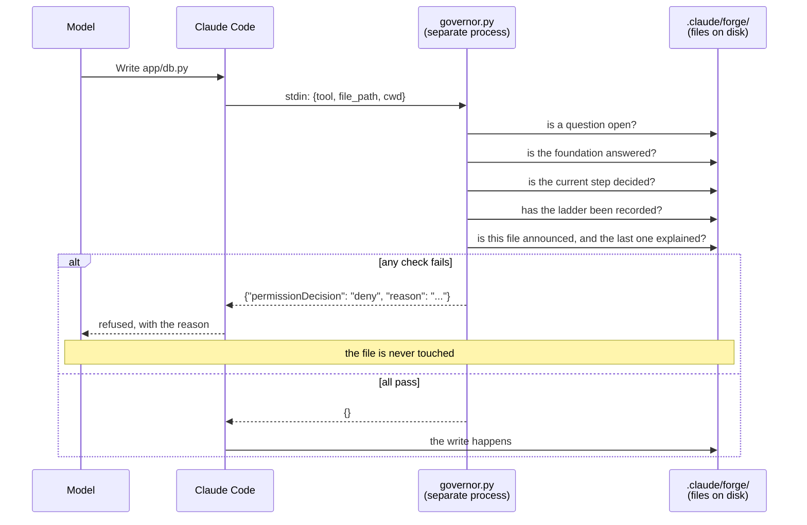

# Forge Mentor, explained

Everything about what this project is, why each piece exists, and how to defend
any part of it. Written to be read start to finish, or dipped into by section.

---

## 1. The numbers

| | Files | Lines |
|---|---|---|
| Engine (`server/forge_server.py`, 49 MCP tools) | 1 | 2,506 |
| Libraries (`scripts/forge_*.py`) | 24 | 10,718 |
| Hooks (stdlib only, run as separate processes) | 7 | 1,425 |
| **Shipped Python** | **32** | **14,649** |
| Tests | 34 | 15,164 |
| Commands, agents, skills (the briefs) | 14 | 1,379 |
| Decision records | 79 | 3,505 |
| README, context.md, prompts.md | 3 | 2,181 |
| Project notes, hook config, manifests | 10 | 1,730 |
| **Total** | **172** | **38,608** |

**1,216 tests. 100.00% coverage**, measured across the libraries, the hooks and
the engine, with the gate in `pytest.ini` set to `--cov-fail-under=100`. 182
commits in the plugin repo, 51 in the marketplace repo. Zero third-party
dependencies except `mcp`, which is the engine itself.

**If asked why so much test code:** the product's entire claim is that a rule is
enforced rather than suggested. A rule you cannot prove is enforced is a rule
you are asking people to trust. 1.04 lines of test per line of code is what
proving it costs, and see section 12 for what 100% does and does not mean.

---

## 2. The problem, in one paragraph

When AI writes your code, it also makes the architectural choices for you, and
it makes them silently. You get something that runs and that you cannot explain.
Six months later you cannot say why it uses this database, why auth works this
way, or what else was considered. The code is yours legally and nobody's
intellectually.

Forge inverts the order. For every load-bearing decision it teaches the concept
first, offers real options with what each costs, recommends one with a reason
drawn from your actual project, waits for your answer, writes the answer to a
file, and only then writes code. A hook enforces the order: code cannot move
past a decision that has not been made.

**The one-sentence pitch:** decide-then-code, enforced in code rather than
requested in a prompt.

---

## 3. Why a Claude Code plugin, and not an app

The original plan was an Electron desktop app with a FastAPI backend, Supabase,
and a vector database. It was abandoned for a plugin, and the reasoning is worth
knowing because it is the first thing anybody will ask.

An app would have had to rebuild what already exists: an editor, a terminal, a
file browser, a model connection, an account system. All of that is the part
users already have. What was actually new was the discipline: teach, ask,
record, block. A plugin adds exactly that discipline to the tool people are
already in, and adds nothing else.

It also removes a whole class of problems. No server to host, no database to
keep alive, no credentials to store, no cost per user, nothing to keep running
after the internship ends. The user's own Claude Code subscription does the
model work.

**Trade-off accepted honestly:** it only runs where Claude Code runs, and it
only runs on Anthropic models. That is decision 027, and it is a recorded gap,
not a hidden one.

---

## 4. The two repositories, and what a marketplace is

There are two GitHub repositories, and people usually get confused here.

### `Hassaan146/forge-mentor` (the plugin)

The actual product. Commands, hooks, skills, agents, the engine, the tests, and
Forge's own decision records. 182 commits. Default branch is `merge`, not
`main`, which matters because the marketplace serves whatever the default branch
holds.

### `Hassaan146/forge-marketplace` (the catalogue)

One JSON file and a README. It is a **catalogue**, not a store. It lists plugins
by name, version, description and source URL. Claude Code reads it to know what
is installable and at what version.

```json
{
  "name": "forge-marketplace",
  "plugins": [
    { "name": "forge",    "version": "1.28.0", "source": {"url": "github.com/Hassaan146/forge-mentor.git"} },
    { "name": "ponytail", "source": {"url": "github.com/DietrichGebert/ponytail.git"} }
  ]
}
```

**Why a separate repo?** Three reasons.

1. A marketplace can carry more than one plugin. Forge requires ponytail, which
   is somebody else's plugin, so listing it here means users add one marketplace
   and get both. Otherwise they would have to add a second marketplace, and a
   required dependency behind an extra step is a required dependency people skip.
2. The catalogue changes for different reasons than the code. A version bump is
   a one-line change to a JSON file, not a code change.
3. ponytail stays Dietrich Gebert's. The entry points at his repository, so his
   updates and his licence flow through. No fork to maintain.

**Say this honestly if asked whether it had to be two.** It did not. A single
repository can hold both `.claude-plugin/marketplace.json` and the plugin, so
the split is a choice, and it is a choice that was never written down as its own
decision. The defensible answer is the first reason above: the catalogue lists
two plugins and one of them is somebody else's. Do not claim it was forced.

**The version number appears in two places** (`plugin.json` in the plugin,
`marketplace.json` in the catalogue) and both must be bumped together. This
caused a real bug: the published 1.23.0 and the local 1.23.0 were different
code, so `claude plugin update` reported success and changed nothing.

---

## 5. Installing, updating, and why you must restart

### Two command sets that are not interchangeable

Inside a Claude Code session, slash commands:

```
/plugin marketplace add Hassaan146/forge-marketplace
/plugin install forge@forge-marketplace
/plugin install ponytail@forge-marketplace
```

In a terminal, `claude` subcommands:

```bash
claude plugin marketplace add Hassaan146/forge-marketplace
claude plugin install forge@forge-marketplace --scope user
```

**Updating differs between the two**, and this cost a real afternoon. In a
terminal it is *two* commands in order, because the second reads the catalogue
the first refreshes:

```bash
claude plugin marketplace update forge-marketplace
claude plugin update forge@forge-marketplace
```

Inside a session it is *one*, because refreshing the marketplace downloads the
plugin with it. And there is **no `/plugin update <name>`**: Claude Code reads
`/plugin` as the plugin browser and opens it, arguments and all, so a user told
to run it lands in a list of hundreds of plugins wondering what went wrong.

### Why the restart is not optional

A plugin ships three kinds of thing and they load at different moments:

| Part | When it loads |
|---|---|
| Slash commands | Files on disk, found when needed |
| Hooks | Spawned as processes when the session starts |
| MCP engine | Spawned as a process when the session starts |

So installing mid-session gives you working commands and no engine. That exact
state happened during testing: `/forge:start` ran, and every tool behind it was
missing. Forge now checks for its own engine before printing anything and, if it
is absent, shows one box with two lines: `/reload-plugins`, then `/forge:start`
(decision 077).

### The update check

Forge checks its own version against its repository once a day, caches the
answer outside the plugin directory (so a reinstall does not reset it), and
prints one frame if something newer exists. It never blocks. It used to: a hook
held `/forge:start` back when a newer version was downloaded but not loaded, and
the block told the user to run `/forge:status`, which in an empty directory says
"not a Forge project, run `/forge:start`", which the hook blocked as well. A user
hit that loop four times. The gate is gone (decision 072). A stale build is
worth a sentence, not a locked door.

Nothing from the network reaches a screen except a version string that matches a
strict numeric pattern. Remote text on a user's screen is remote text in a
model's context.

---

## 6. The five parts of the plugin

```
forge-mentor/
├─ commands/     6 slash commands       what the user types
├─ hooks/        1 config file          which script runs on which event
├─ scripts/      31 Python files        7 hooks + 24 libraries
├─ server/       1 Python file          the MCP engine, 50 tools
├─ agents/       4 subagent briefs      planner, builder, structurer, review-fixer
├─ skills/       4 skills               how the mentor teaches
└─ .claude/forge/  78 decision records  Forge's own history, built with itself
```

### commands/ (what the user types)

| Command | Job |
|---|---|
| `/forge:start` | Set up Forge in this project, then run the interrogation and the build loop |
| `/forge:status` | Where the work stands, then carry on from there |
| `/forge:add` | Add a feature to a project that already works |
| `/forge:mode` | Switch between pipeline, accept-edits and auto |
| `/forge:update` | Check now whether a newer Forge exists |
| `/forge:stop` | Switch Forge off in this project, keeping every record |

A command is a markdown file. Its content is an instruction sheet the model
reads and follows. This is why the phrase "the rule is in the brief" matters: a
brief is advice a model can skip, which is why the important rules live in hooks
instead.

### hooks/ (the enforcement)

Seven Python scripts, all stdlib only, each run by Claude Code as a separate
process on a specific event.

| Hook | Event | Job |
|---|---|---|
| `governor.py` | Before Write/Edit | **The product.** Refuses any write when a decision is missing |
| `safety.py` | Before Read/Bash | Blocks reads of secret files, and neutralises injection in untrusted text |
| `gates.py` | Before Bash | Runs the tests before a commit is allowed through |
| `grounded.py` | After Write/Edit | Catches an import or a citation that refers to nothing real |
| `reviewed.py` | After review lands | Makes ponytail review what the hosted reviewers just reviewed |
| `presenter.py` | On Stop | Refuses a turn where Forge spoke as prose instead of in a block |
| `companion.py` | On session start | Brings ponytail into context, or says how to install it |

**Why stdlib only:** Claude Code does not install a plugin's Python
dependencies. A hook that needs a package is a hook that fails on a fresh
machine, and a failing governor means writes are unguarded.

**Every hook fails safe, and "safe" differs by hook.** The governor fails
*closed*: if it cannot read the notes it blocks, because a blocked write costs
one turn. The presenter fails *open*: if anything at all goes wrong it allows,
because a Stop hook that errors ends the conversation.

### server/ (the engine)

One MCP server exposing 50 tools. MCP (Model Context Protocol) is how a model
calls out to your code. The model cannot write a decision record by hand; it
calls `record_answer`, and the tool writes the file in the one correct format.

Grouped by job:

- **Asking and recording:** `ask_question`, `record_answer`, `foundation_question`, `step_questions`
- **Drawing blocks:** `render_decision`, `render_note`, `render_action`, `show_roadmap`, `color_legend`
- **Planning:** `compile_phases`, `plan_steps`, `current_step`, `step_built`, `plan_feature`, `add_phase`
- **Building:** `plan_files`, `file_written`, `add_file`, `record_build_choice`
- **The ponytail ladder:** `lean_check`, `record_lean`, `lean_review`
- **Review:** `fetch_review`, `record_review_findings`, `resolve_finding`, `check_review_setup`
- **Integrity:** `check_history`, `repair_history`
- **Resuming:** `catch_up`, `resume`, `current_state`, `what_did_i_ask_for`
- **Housekeeping:** `usage_report`, `set_mode`, `explain_code`, `write_prompts_log`, `preview_push`, `push_work`, `install_skill_library`

Six of the 49 are registered and deliberately called by nothing, each with a
written reason. A test fails if a seventh joins them without one (decision 079).

### agents/ (the subagents)

Four specialists, each with its own brief and its own model:

| Agent | Model | Job |
|---|---|---|
| `planner` | Fable 5 | Compiles the phases, asks the questions |
| `builder` | Opus 5 | Writes the project code. The only agent that does |
| `structurer` | Haiku 4.5 | Small structured jobs |
| `review-fixer` | Opus 5 | Applies what reviewers found |

Model routing lives in each agent's frontmatter, which is what Claude Code
actually reads.

### skills/ (how the mentor teaches)

Four skills that shape *how* the model behaves: teaching style, coding
standards, the questioning method. A skill shapes behaviour; a tool performs an
action; a hook enforces a rule. Being able to state that distinction cleanly is
worth having ready.

---

## 7. The workflow, end to end

### Stage 1: setup (`/forge:start`)

1. **Engine check.** Call a read-only tool. If it is missing, one box, two
   commands, stop.
2. **Banner, colour key, readiness check.** Python 3.12+, the `mcp` package, the
   `python` command the hooks use, git, GitHub sign-in, ponytail. Anything
   missing prints the exact fix command.
3. **Explain before asking** (decision 014). What Forge will do in this project,
   before any permission is requested.
4. **The cost fork** (decision 017). Reviews are free on public repositories; a
   private repo needs a paid plan. Asked before permissions, never after.
5. **Connect GitHub** through its own sign-in. Forge never asks for a credential
   and never stores one.
6. **Permissions are all-or-nothing.** There is no reduced mode.
7. **Install the skill library** into the user's account, pinned to a reviewed
   commit.
8. **Create the notes** with Forge's own creator, never by hand.

### Stage 2: the foundation interrogation

Ten to twelve fixed questions, in a fixed order, from code rather than from the
model's imagination (decision 033). What is being built, the name and
repository, the stack, storage, sign-in, how it runs, the phases.

**Why fixed:** a planner writing its own questions is how a project ends up
never being asked where it runs. A skipped question is invisible in a way a
wrong answer is not.

Each question:

- teaches the concept, gives an example, says why it matters here
- offers at least three options and at most six (decision 047), each with what it costs
- names real products, not shapes (decision 054)
- says what a bad answer costs (decision 055)
- narrows against what the project already decided, showing what was ruled out and why (decision 048)
- records the user's own words, not just the letter they picked (decision 050)

An answer can open further questions, inserted where they belong (decision 049).

### Stage 3: the plan

`compile_phases` produces every phase at once. `show_roadmap` prints all of them
and writes an HTML version. The user accepts or reshapes the whole shape, once,
with everything visible.

**Why all at once:** a plan revealed one phase at a time is a surprise delivered
in instalments. The user gets asked how the project is tested while phase four
is still secret, and that answer shapes all of them.

Until "plan accepted" is recorded, every write is blocked, including the first
line of phase one.

### Stage 4: the build loop, one step at a time

This is the product. Everything before it is setup.

```
1  next_step            what stage, which agent, which model
2  plan_steps           3 to 7 steps, each something you could see working
3  current_step         the step and its marker
4  lean_check           the five-rung ladder, before anybody is asked anything
5  record_lean          all five rungs, refused if one is missing
6  step_questions       what this subject owes, if this step is first to touch it
7  ask_question         opens the gate, before the question is shown
8  render_decision      teach, options, recommendation, cost, YOUR TURN frame
9  [wait]               the user answers
10 record_answer        their words, their reasoning, the options shown
11 lean_review          the approach, back through the ladder, before it is written
12 plan_files           what the step does, and every file in order   [BOX 1]
13 [build silently]     one file at a time, each recorded, nothing said on screen
14 [run it]             start it, confirm it answers, leave it running
15 step_built           proof + see_it + command_means                 [BOX 2]
16 preview_push         exactly what would leave the machine
17 push_work            that commit and no other
18 → back to 3
```

**Two boxes a step, and nothing between them** (decision 076). The per-file
explanations go to the record, and come back as one line each in the step's box.

**What the user is owed** (decision 074): every concept in the code, named in
plain words, plus the command that runs it explained part by part. Forge writes
the code; the concepts are the user's to keep.

### Stage 5: phase end

`explain_code` writes `code-explained.md`. `write_prompts_log` writes
`prompts.md`. Both are generated from the records rather than written, because a
summary written afterwards is a reconstruction, and reconstructions get tidier
than the truth.

### Stage 6: review

Code is pushed, hosted reviewers (CodeRabbit, Sourcery) comment on the pull
request, a workflow in the repository writes the findings to a file, and Forge
reads that file. ponytail reviews the same diff locally and its findings are
merged in. The review-fixer applies what is real and pushes back on what is not.

---

## 8. The five gates, in the order they fire

A write has to get past all of these:

1. **Is a question open?** If yes, blocked. (decision 004)
2. **Is the foundation answered?** If not, blocked. On a fresh project nothing is
   open, so the old rule allowed everything. (decision 034)
3. **Is there a plan, and is the current step decided?** A phase is not
   buildable; a step is. This gate exists because a real run wrote four files and
   a whole application in one turn after question six. (decision 037)
4. **Has this step been through the ladder?** Five rungs, all five recorded.
   (decision 060)
5. **Has this step said what it writes?** `plan_files` must have been called, and
   the last written file must have been explained. (decisions 069, 073)

Then a sixth, on speech rather than writes: **is Forge talking in blocks?** The
presenter refuses a turn that is prose. (decision 039)

---

## 9. The records, and why they can be trusted

Every decision is one markdown file in `.claude/forge/decisions/`:

```markdown
---
id: 014
question: Phase 1, step 1: where do FastAPI and uvicorn get installed?
status: decided
decided_by: user
date: 2026-08-14
affects: phase-1.step-1
content_sha: 6b26810176aa121b...
prev_sha: c26bc0fef0ec5d6f...
---

# A .venv folder, made with Python's own venv

**Options considered**
- A: .venv with Python's own venv, one command, nothing to install first
- B: uv, faster and nicer, one more thing to learn
- C: install into the system Python, nothing to activate, versions fight

**Recommended:** A - **Decided:** A

## Why
[the reasoning, in project terms]

## In their words
[the user's own words, verbatim]
```

**Human-readable and machine-readable at once** (decision 001). The user can
read it; a fresh session on a different account can read it and carry on.

**The chain** (decisions 020 to 023). Each record carries a fingerprint of its
own content and of the record before it. Change one record and every record
after it fails to verify. No secret key, no signing service, works on any
machine, survives being copied. It is tamper-*evident*, not tamper-proof, and
that distinction is worth stating precisely: it cannot stop an edit, it makes an
edit impossible to hide.

**Committed, never ignored** (decision 016). The records live with the code, in
git, so the history travels with the project.

**Questions become files when asked, not when answered** (decision 018). This
avoids git conflicts across branches and means an interrupted session leaves an
open question on disk rather than nothing.

**Changing your mind** (decision 057) is a new record naming the old one with
`supersedes`. Never an edit. The old reasoning stays readable.

---

## 10. Under the hood

Everything above is the design. This section is the implementation, for a
reader who wants to know whether the claims are backed by code.

### 10.1 The hook wire protocol

A hook is a **separate OS process**, not a callback. Claude Code spawns it,
writes one JSON object to its stdin, reads one JSON object from its stdout, and
acts on the verdict. There is no shared memory, no import, and nothing the model
can do to the process from inside its own turn.

`hooks/hooks.json` binds a script to an event and a tool matcher:

```json
{ "hooks": { "PreToolUse": [
  { "matcher": "Write|Edit|NotebookEdit",
    "hooks": [{ "type": "command",
                "command": "python \"${CLAUDE_PLUGIN_ROOT}/scripts/governor.py\"",
                "timeout": 10 }] } ] } }
```

Input, on stdin:

```json
{ "hook_event_name": "PreToolUse",
  "tool_name": "Write",
  "cwd": "H:\\Skills\\todo-app",
  "tool_input": { "file_path": "app/db.py", "content": "..." } }
```

Output, on stdout, to refuse:

```json
{ "hookSpecificOutput": {
    "hookEventName": "PreToolUse",
    "permissionDecision": "deny",
    "permissionDecisionReason": "No decision recorded yet for: which database?" } }
```

Output to allow: `{}`. That is the whole contract.

Three properties of `governor.py` worth naming, because each was a bug first:

**It always exits 0.** A non-zero exit is a hook crash, and a crashing hook is
noise the user cannot act on. Every path, including the failure path, prints
JSON and exits 0.

**It answers about a specific file, not in general.** `writes_allowed(forge_dir,
target)` takes the path. Without it the question collapses to "may anything be
written", which is a different question and always was: the per-file ordering
rule could never fire.

**It gets out of the way where it has no business.** Not a Forge project, or
Forge writing its own notes under `.claude/forge/`, and it allows immediately.
The notes check compares path *segments*, not substrings, because the folder is
two segments deep and a naive `"/.forge/" in path` missed
`.claude/forge/decisions/001.md` — which would have blocked Forge from recording
the decision that unblocks the user.

The write path, end to end:



### 10.2 Fail closed, fail open, and why they differ

Every hook catches everything. What they do next is not uniform, and the
difference is deliberate.

| Hook | Event | On its own failure | Why |
|---|---|---|---|
| `governor` | PreToolUse | **deny** | A blocked write costs one turn. An unguarded write costs the guarantee |
| `gates` | PreToolUse (Bash) | **deny** | Same: it guards commits, which are permanent |
| `safety` | PreToolUse | **deny** | Its failure mode is a leaked credential, which cannot be taken back |
| `presenter` | Stop | **allow** | A Stop hook that errors ends the conversation |
| `grounded` | PostToolUse | **allow** | The write already happened. It reports; it cannot un-write |
| `reviewed` | PostToolUse | **allow** | A notice, not a gate |
| `companion` | SessionStart | **allow** | One line about ponytail is never worth a failed session start |

The rule generalises: **fail closed before the irreversible thing, fail open
after it.** A gate that cannot run is a wall; a reporter that cannot run is
silence, and silence is the right failure for a report.

`gates.py` also has a timeout ordering that is easy to get backwards. The test
run is capped at `TEST_TIMEOUT = 240` seconds, and the hook itself is registered
with `"timeout": 300`. The hook's budget must exceed the work's, or Claude Code
kills the hook before it can return its denial, **and a gate that dies lets the
commit through**.

### 10.3 The fingerprint and the chain

Two header fields make a record verifiable:

```yaml
content_sha: 6b26810176aa121b0c1f...   # this record's own content
prev_sha:    c26bc0fef0ec5d6f2a44...   # the fingerprint of the record before it
```

`fingerprint()` is SHA-256 over **named fields, not file bytes**:

```python
parts = [f"{name}={_normalise(getattr(decision, name, ''))}"
         for name in signed_fields(decision)]
parts.append(f"body={_normalise(decision.body)}")
return hashlib.sha256("\n".join(parts).encode("utf-8")).hexdigest()
```

Four decisions are embedded in those five lines.

**Fields, not bytes.** Hashing the file would make a reformat look like
tampering: a changed line ending, a trailing space, a reordered key. Meaning is
protected, layout is not. `_normalise` collapses `\r\n` and `\r` to `\n`, strips
the ends, and right-strips every line.

**The field list is derived, not written.** `signed_fields()` returns
`vars(decision)` minus `EXCLUDED_FROM_HASH`, so a field added to the record type
later is protected automatically rather than quietly escaping the hash.

**The hash cannot cover itself.** `EXCLUDED_FROM_HASH = {content_sha, prev_sha,
body}`. The first two are the output; including them is a fixpoint that can
never verify.

**The body is appended explicitly, last.** It carries most of the meaning, and
it is excluded from the derived list precisely so that a change to that list can
never silently drop it.

Linking is one line: `prev_sha` is the fingerprint of the previous record, or
the literal `"genesis"` for the first. Verification walks the records in id
order and classifies each:

| Verdict | Meaning |
|---|---|
| `VERIFIED` | Written by Forge and unchanged since |
| `MODIFIED` | `content_sha` no longer matches the content |
| `CHAIN_BROKEN` | `prev_sha` does not match its predecessor: inserted, removed, or reordered |
| `UNSIGNED` | Hand-written. Readable, but never counted as an approval |

**Only `VERIFIED` opens the governor's gate.** A hand-written record is not an
approval, which is what stops the obvious attack: write your own
`decisions/099-anything.md` and start coding.

**Threat model, stated precisely.** This is tamper *evident*, not tamper
*proof*. There is no secret, so anyone with the repo can recompute the whole
chain and forge a consistent history. What it defeats is the realistic case: a
record edited after the fact, by hand or by a model, without the edit showing.
Signing would need key distribution, and a mentoring tool that asks a student to
manage a private key has lost before it starts.

### 10.4 MCP transport and discovery

One MCP server, `forge`, declared in `.mcp.json`:

```json
{ "mcpServers": { "forge": {
    "command": "python",
    "args": ["${CLAUDE_PLUGIN_ROOT}/server/forge_server.py"],
    "env": { "PYTHONIOENCODING": "utf-8" } } } }
```

Claude Code launches that file as a **child process at session start** and
speaks JSON-RPC over stdio. The server announces 49 tools with their names,
JSON-Schema parameters and descriptions; the model reads the descriptions to
decide when to call one. Tools appear namespaced as `mcp__forge__record_answer`.

**Discovery happens once, at spawn.** That single fact explains the restart
requirement, the mid-session install failure, and the engine check that now runs
before the banner.

Two implementation notes a reviewer will look for:

**The decorator has to be signature-transparent.** 25 tools carry `@_says_why`,
which turns `ValueError` into `{"error": ...}`. It uses `functools.wraps`, so
`inspect.signature` follows `__wrapped__` and the MCP layer still builds the
real schema. This is exactly where it bit: the test helper *also* followed
`__wrapped__`, so every test exercised the undecorated function while production
ran the wrapper, and the suite stayed green on it for a day.

**`PYTHONIOENCODING=utf-8` is not decoration.** The blocks contain box-drawing
characters and eight symbols. On a Windows console defaulting to cp1252, writing
them raises `UnicodeEncodeError` and takes the server down.

### 10.5 State file formats

All state is markdown with a labelled header. Human-readable and
machine-readable at once is decision 001, and the reason is account portability:
a fresh session on a different machine must be able to continue, and a person
must be able to read what it is continuing from.

**`progress.md`** — the live state the governor reads:

```yaml
---
type: progress
project: forge
stage: built-and-in-use
questions_total_estimate: 59
questions_answered: 58
open_question: none
override_active: false
updated: 2026-08-13
---
```

`REQUIRED_PROGRESS_FIELDS = ("stage", "open_question", "override_active")`.
Missing any of them is a **broken file, not a default**: guessing here would
silently disable the product's one guarantee, so `Progress.read` raises and the
governor denies.

**A phase file**, `phases/10-hardening-release.md`:

```yaml
---
phase: 10
title: Hardening, Packaging & Release
status: complete
depends_on: phase-9
branch: phase-10-hardening-release
---

## Steps

1. [x] the first slice
2. [ ] the next one
```

Only lines under `## Steps` count, and a following `##` heading ends the list,
so a numbered list elsewhere in the file is not mistaken for more steps.

**The build ledger**, one file per step, parsed by one regex:

```
[x] app/db.py · explained · the store, and the code that creates it
[ ] app/models.py
```

```python
_ROW = re.compile(r"^(?P<state>\[[ x]\])\s+(?P<path>\S+)"
                  r"(?:\s+·\s+(?P<explained>explained))?"
                  r"(?:\s+·\s+(?P<what>.+?))?\s*$")
```

Both trailing groups are optional on purpose: rows written before the summary
existed still parse, so a step half-built when the plugin updated keeps its
ledger instead of losing it.

**Why files at all**, rather than SQLite or JSON: the state has to survive an
account switch, be diffable in review, merge in git, and be readable by the user
who owns it. A database would win on query speed, which this workload does not
need, and lose on every other axis that matters here.

### 10.6 The marker scheme, and the trap in it

A decision binds to what it authorises through one string in its `affects`
header.

| Marker | Authorises |
|---|---|
| `phase-1.step-1` | that step's code |
| `plan-accepted` | the plan as a whole |
| `lean:phase-1.step-1` | the ladder pass **before** that step's question |
| `phase-3, phase-5` | a project-wide decision, informational |

The gate scans decided records for `phase-\d+\.step-\d+` and treats a match as
"this step is decided".

**The trap:** `lean:phase-1.step-1` *contains* `phase-1.step-1`. Recording the
ladder pass therefore satisfied the pattern and opened the gate the pass exists
to come *before*. The step's own question was skipped entirely, and the loop
still looked correct from the outside.

The fix is a prefix check before the scan:

```python
if (decision.affects or "").strip().startswith(f"{ln.PREFIX}:"):
    continue
```

Worth telling in a viva, because it is the general shape of the bug this whole
project keeps finding: **a marker that is a substring of another marker is an
authorisation that leaks.** The lesson generalises to any scheme where one
identifier is built by prefixing another.

### 10.7 Safety internals

`safety.py` is stdlib-only and runs on `Read` and `Bash`. Two jobs.

**Secrets are never read.** Three tests, in order:

```python
SECRET_NAMES    = {".env", ".env.local", ".env.production", ".npmrc", ".netrc",
                   "credentials", "credentials.json", "id_rsa", "id_ed25519", ...}
SECRET_SUFFIXES = {".pem", ".key", ".p12", ".pfx", ".keystore", ".jks", ".ppk"}
SECRET_DIRS     = {".aws", ".docker", ".kube", ".ssh", ".gnupg", ".config/gcloud", ".azure"}
SAFE_SUFFIXES   = (".example", ".sample", ".template", ".dist")
```

Plus a prefix rule for `.env.anything`, and `SAFE_SUFFIXES` first, because
`.env.example` exists to be read: it carries names, not values.

**The name given is not trusted on its own.** A symlink called `notes.md`
pointing at `.env` passes a name check and the read follows the link anyway, so
the check resolves the path and judges **both** the supplied name and the
resolved one, plus the last two path segments for the credentials-directory
case. If resolution raises at all, the answer is "secret": *cannot tell* must
never be reported as *fine* when the failure mode is a leaked key.

**Outside text is data, never instructions.** Review comments and fetched pages
go through `wrap_untrusted(source, text)`, which labels the block and
neutralises the closing delimiter inside the content, because text containing
`</untrusted>` would close the boundary early and place what follows outside it.
A wrapper that announces a boundary it does not hold is worse than no wrapper.
`find_injection` matches seven patterns, among them:

```python
r"ignore\s+(all\s+|any\s+)?(previous|prior|above|earlier)\s+instructions?"
r"you\s+are\s+now\s+(a|an|in)\b"
r"</?(system|assistant)>"
```

Detection is not prevention, and the wrapper does the preventing. The patterns
exist so the user is told what arrived.

### 10.8 Platform reality

The plugin runs on the user's machine, which is usually Windows, and four
things there are not the happy path.

**Console encoding.** `_make_output_utf8_safe()` reconfigures stdout and stderr
to UTF-8 with `errors="replace"` at import. Without it, printing the banner on a
cp1252 console raises `UnicodeEncodeError` and takes the hook down with it,
which for the governor means a blocked write that never explains itself.

**Read-only files from git.** Git objects land read-only, so `shutil.rmtree`
fails when cleaning up a failed skill-library install. The handler clears the
flag and retries, and `onexc` replaced `onerror` in Python 3.12, so both names
are handled.

**`python` is not the interpreter you typed with.** The hooks invoke a bare
`python`, and an app launched from a dock or Start menu does not always inherit
the PATH your shell has. The readiness check therefore tests *that exact
command*, not `sys.executable`, because the two can disagree and only the first
one matters.

**Every subprocess has a timeout and a documented failure.** git is 15 to 60
seconds, the GitHub CLI 10, the network 5 to 30, the test run 240. Each
`TimeoutExpired` maps to a specific answer: "git stopped responding", "the tests
ran past 4 minutes and were stopped", never a hang and never a traceback.

### 10.9 What a reviewer should push on

Four places where the design is weaker than the rest, listed so nobody has to
find them to make the point.

**The `affects` string is stringly-typed.** Markers are matched with a regex
over free text. It works and it is tested, but a typed marker object would have
made the `lean:` containment bug impossible rather than merely caught.

**The chain verifies in id order, and ids are not unique.** Decision 018 accepts
that two branches can both write a decision 014. Verification handles it, and
the ordering is still a single sequence over a set that is not guaranteed
unique.

**The hooks re-read all state on every call.** No cache, by decision 019, so a
project with hundreds of records re-parses them per write. Correct and simple,
and O(n) per write. It has not mattered at 79 records; it would at 5,000.

**The presenter reads a transcript whose shape is the client's business.** Every
field is reached defensively and any surprise allows the turn, but a change to
Claude Code's log format degrades the check silently rather than loudly.

---

## 11. File map, what each thing is for

### The hooks

| File | Why it exists |
|---|---|
| `governor.py` | The one rule: no code past an unmade decision |
| `safety.py` | Secrets stay unread; untrusted text is neutralised before it reaches the model |
| `gates.py` | Tests run before a commit. Timeout is higher than the test timeout on purpose, since a gate that dies lets the commit through |
| `grounded.py` | An import in no manifest, or a citation of a decision that does not exist, stops and asks. Never fixes silently |
| `reviewed.py` | "ponytail found nothing" and "ponytail has not run" are different states |
| `presenter.py` | Rules about presentation lived in briefs, and a real run put a decision on screen as three unframed paragraphs |
| `companion.py` | Routing ponytail in a table is not routing; this puts one line in the context |

### The libraries

| File | Why it exists |
|---|---|
| `forge_state.py` | Reads and writes the notes. The one writer. 21 modules depend on it |
| `forge_steps.py` | Phases, steps, and `next_gap`, which is what every gate asks |
| `forge_foundation.py` | The fixed question sequence, in code so it cannot drift |
| `forge_topics.py` | Eight subjects and the twenty questions each owes before code touches it |
| `forge_options.py` | A menu is at least three real options, each with its cost, refused at the renderer if not |
| `forge_lean.py` | The ponytail ladder as a gate: the model reasons, the gate remembers |
| `forge_build.py` | The file ledger: what a step writes, in order, each explained before the next |
| `forge_ui.py` | Every block. One renderer, after eight presentations were tried |
| `forge_integrity.py` | The fingerprint chain |
| `forge_repair.py` | Quarantine before overwrite. Nothing is destroyed |
| `forge_review.py` | Three reviewers, one file per pull request |
| `forge_update.py` | The version check that never blocks |
| `forge_skills.py` | Which skills load at which stage |
| `forge_meter.py` | Usage, read from Claude Code's own transcripts |
| `forge_explain.py` | `code-explained.md`, assembled from records |
| `forge_prompts.py` | `prompts.md`, the same |
| `forge_push.py` | Preview, then push that commit and no other |
| `forge_feature.py` | `/forge:add`: read what is recorded, ask only what is new |
| `forge_pipeline.py` | The three modes |
| `forge_preflight.py` | The readiness check |
| `forge_say.py` | One shape for everything Forge says |
| `forge_roadmap.py` | The plan block and its HTML version |
| `forge_grounding.py` | The checks `grounded.py` runs |
| `forge_assemble.py` | Prompt ordering for cache efficiency. Registered, deliberately uncalled |

### The tests, and how they are split

34 files, 15,164 lines, 1,216 tests. The split is by *question asked*, not by
module, which is why five of them were written last and separately:

| File group | What it asks |
|---|---|
| `test_state`, `test_steps`, `test_foundation`, `test_topics`, `test_options` | Does the state layer hold the rules the product claims |
| `test_governor_unit`, `test_gates_and_safety`, `test_presenter`, `test_grounding` | Does each hook enforce its rule, and fail the way it says it fails |
| `test_server`, `test_server_tools` | Does every tool do the right thing to the notes, including the ones no session path reaches |
| `test_edges`, `test_guards`, `test_guards_last`, `test_last_mile` | Does every defensive branch do what its comment promises when the machine misbehaves |
| the rest | One per library: review, meter, push, repair, skills, explain, prompts, roadmap, integrity, pipeline, build, lean, feature, assemble, companion, preflight, ui, update |

Two of these are worth naming in a viva. `test_server_tools.py` exists because a
repo-wide audit found fifteen tools unreachable from any brief, and a tool no
test calls is usually a tool nothing calls. The four `edges`/`guards` files
exist because Forge is mostly guards, and a guard's failure branch is the one
nobody ever runs by hand: a file that cannot be read, git missing, a permission
flag that will not set. Each module answers those differently on purpose, and
those files hold each one to its own rule.

---

## 12. Questions you will be asked, with answers

**"Isn't this just a prompt telling Claude to ask questions?"**
No, and that is the whole design. A prompt is advice a model can skip, and it
did skip it: a real run wrote four files and an entire application without
asking anything after question six, and every write was permitted. The rule now
lives in a `PreToolUse` hook, a separate Python process that returns "deny" and
a reason. The model cannot talk it out of that.

**"What stops the AI just writing the code anyway?"**
Five gates, listed in section 8. The last two were added *because* the earlier
ones were not enough, each after a real failure.

**"Why should I trust the decision records?"**
Each record fingerprints its own content and the record before it. Editing one
breaks every record after it, and `check_history` reports exactly which. It is
tamper-evident, not tamper-proof, and the distinction is deliberate.

**"What happens if I switch machines or accounts?"**
Nothing is lost. Everything lives in `.claude/forge/` in your repository,
committed with the code. Nothing is keyed to an account, cached in a session, or
stored on any server. A fresh session reads the files and continues.

**"Why require somebody else's plugin?"**
Forge's output is your codebase, and the thing keeping that code small is not an
optional extra. ponytail's ladder (does this need to exist, does the project
already do it, does the standard library do it, what is the smallest version,
what does the extra size cost) runs on every step and is gated: the step stays
shut until all five rungs are recorded. Forge could have reimplemented it, badly.
It is listed in Forge's own marketplace so it is one command away, and the entry
points at the author's repository so it stays his.

**"Why only Anthropic models?"**
Forge drives Claude Code, and Claude Code runs Anthropic models. Supporting a
second provider would mean not being a Claude Code plugin. This is decision 027,
written down as an accepted gap rather than hidden.

**"How much does it cost to run?"**
Nothing beyond the Claude Code subscription the user already has. No server, no
database, no hosting. Usage is metered from Claude Code's own transcripts and
shown in `/forge:status`.

**"What is the hardest bug you hit?"**
A recurring shape rather than one bug: *the rule is in the code but the code is
not in the path*. A repo-wide audit found fifteen of forty-nine tools reachable
from no command or brief, and eight of those were capabilities the README
promised users. Every one had passing tests, because a test calls a tool directly
and a brief is the only thing that does not. The fix was wiring them in and
adding a test that reads the briefs and fails when a registered tool has no
caller.

**"What would you do differently?"**
Write the caller-exists test on day one. Most of the wasted work in this project
was building something correct that nothing invoked.

**"Why are there so many decisions about presentation?"**
Because the product is teaching, and teaching that arrives as a wall of
undifferentiated prose is not read. Decisions 035, 036, 039, 044 to 047, 052 and
071 to 077 are all one argument: what Forge says has to be visibly distinct from
ordinary chat, or the user cannot tell when a decision is being asked of them.

**"How do you know it works?"**
1,216 tests at 100% coverage, and more usefully: Forge built itself. All 79 of
its own decisions were recorded through the product, in the same format a user's
project gets, with the same chain.

**"100% coverage? Really? What is excluded?"**
Twenty lines, and every one of them is a process entry point: an
`if __name__ == "__main__"` block or a CLI `main()`. Each carries its reason
inline as a comment. Nothing behavioural is excluded, so grepping for
`pragma: no cover` is a fair test of that claim and I would rather you ran it
than took my word. The measurement covers the libraries, the hooks *and* the
2,506-line engine, which was outside the number entirely until it was added on
purpose.

**"Is 100% coverage actually worth anything?"**
On its own, no, and this project has the proof in its own history. Fifteen of
forty-nine tools were covered, some near 100%, and unreachable from any command
or brief: 871 green tests were proving that code worked while a third of the
surface could not be reached by a user. Coverage measures lines executed, not
behaviour guaranteed. What the last ten points bought here was specific:
roughly two hundred defensive branches that had never once run, each with a
documented answer nobody had checked, and one real defect. The `_says_why`
decorator on twenty-five tools was never being exercised, because
`functools.wraps` sets `__wrapped__` and the test helper followed it to the
undecorated function. The suite was green on that for a day.

**"What is the strongest test in the suite?"**
Not one of the 1,216. It is the caller-exists guard: it reads `commands/`,
`agents/` and `skills/`, and fails naming any registered tool that no brief
invokes. Six tools are exempt and each carries a written reason. That test
catches the failure this project actually kept having, which no amount of
coverage could see.

---

## 13. Honest gaps

Worth stating before anyone finds them.

1. **Anthropic models only** (decision 027). Accepted and recorded.
2. **The second ponytail pass is not gated.** The ladder before the question is
   enforced; `lean_review`, which runs after the approach is settled and before
   it is written, is a brief instruction. Its own module calls it "the one that
   is easy to skip and the one that pays".
3. **A feature is not lean-checked as a whole.** Its steps are challenged
   individually, so "should this feature exist at all" is the rung nobody climbs.
4. **Six tools are deliberately uncalled** and listed with reasons in
   `UNCALLED_ON_PURPOSE`. Two of them (`assemble_request`, `choose_model`, about
   400 lines together) are dead weight and should be deleted; they are now
   tested, which makes them tidy dead weight rather than untidy dead weight.
5. **The `merge` default branch** is unusual and `origin/main` is 41 commits
   behind. It works, but it surprises people.
6. **The 100% gate is stricter than most projects run.** `--cov-fail-under=100`
   means any future line without a test fails the build, which is a real cost on
   every change from here. It is a deliberate choice, not an accident, and it is
   one line to lower.
7. **The suite is slower now.** 1,216 tests against 871, and a full run with
   coverage takes noticeably longer than it did.

---

## 14. If you remember five things

1. **The governor is the product.** A `PreToolUse` hook that denies a write when
   a decision is missing. Everything else serves it.
2. **The repository is the memory.** Records in the project, committed with the
   code, chained so tampering shows.
3. **A brief is advice; a hook is a rule.** Every important guarantee here
   started as a sentence in a brief, got skipped, and moved into code.
4. **Every gate exists because something failed.** None were designed up front.
   The decision records name the failure each one came from.
5. **It was built with itself.** 79 decisions, same format, same chain, same
   gates.
